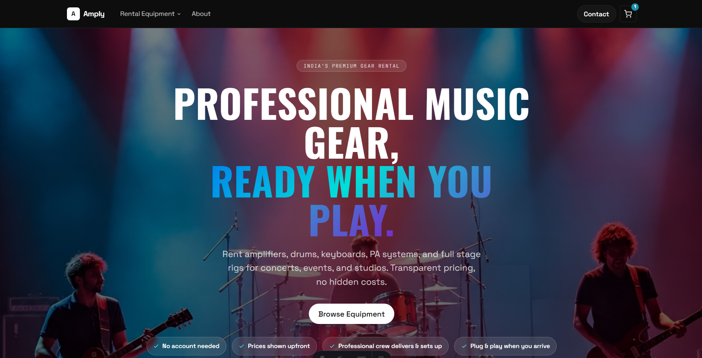
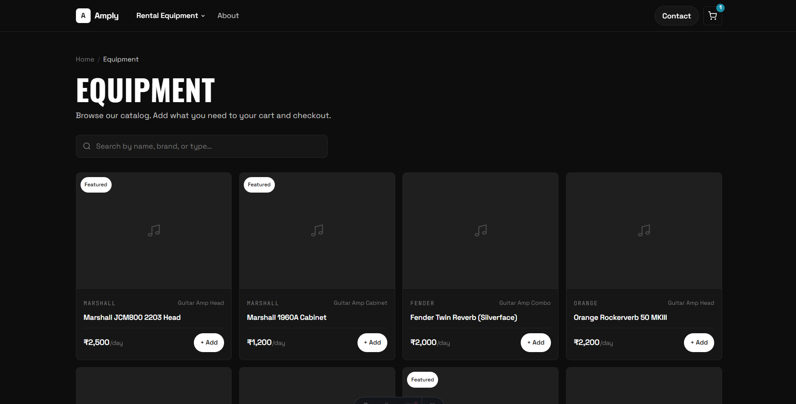
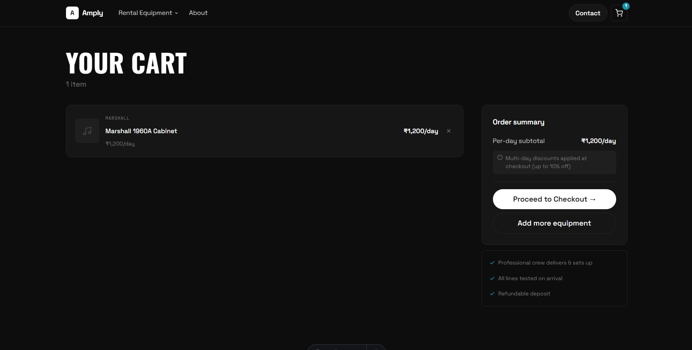

# Backline India

Backline rental site for events, concerts, and studios across Gujarat — browse equipment, add to cart, and checkout with no account needed. Built with [Astro](https://astro.build) + Tailwind CSS.

  
  

## Features

- Equipment catalog with search, filtering, and related-accessory recommendations
- Cart + checkout flow (order details submitted via Netlify Forms, no payment gateway — payment is UPI/bank transfer post-confirmation)
- Fully static, no backend or database

## Commands

| Command         | Action                          |
| :--------------- | :------------------------------ |
| `npm install`     | Install dependencies            |
| `npm run dev`     | Start dev server (`localhost:4321`) |
| `npm run build`   | Build to `./dist/`              |
| `npm run preview` | Preview the production build    |
